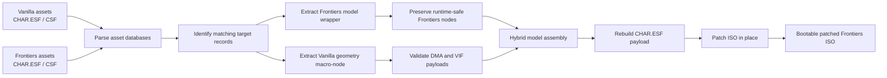
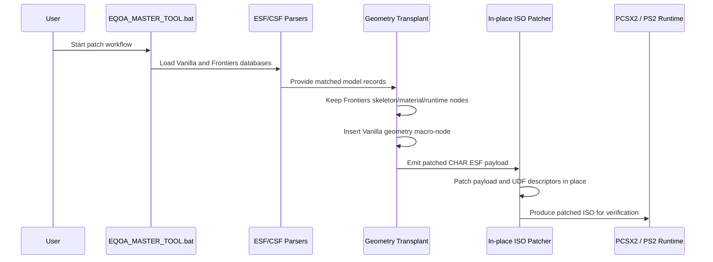
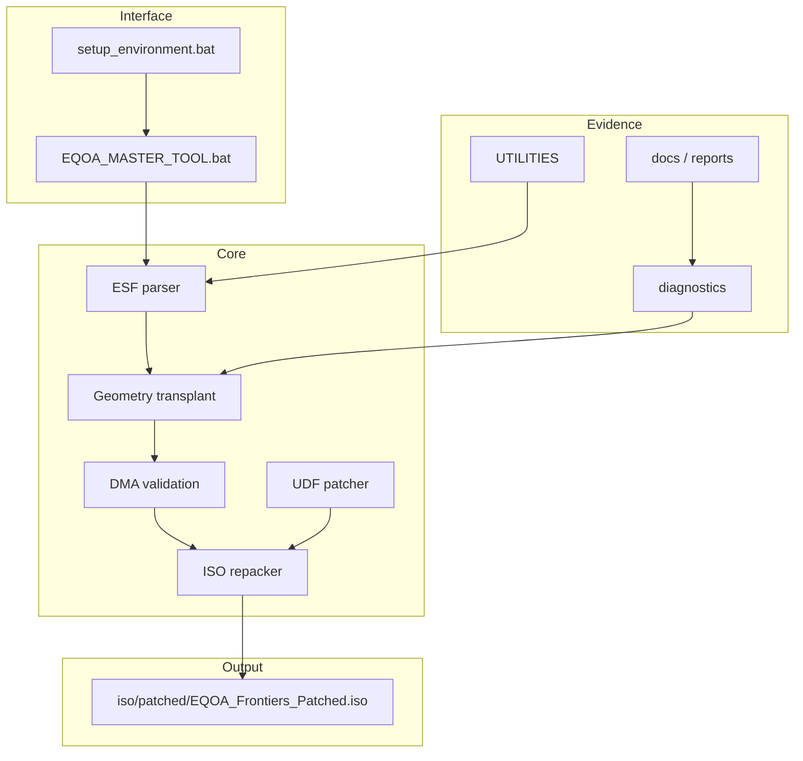
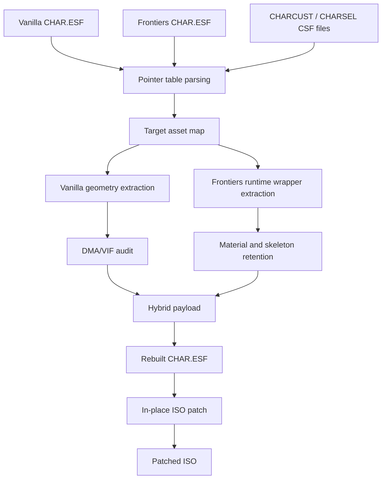
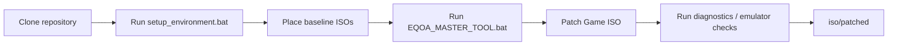
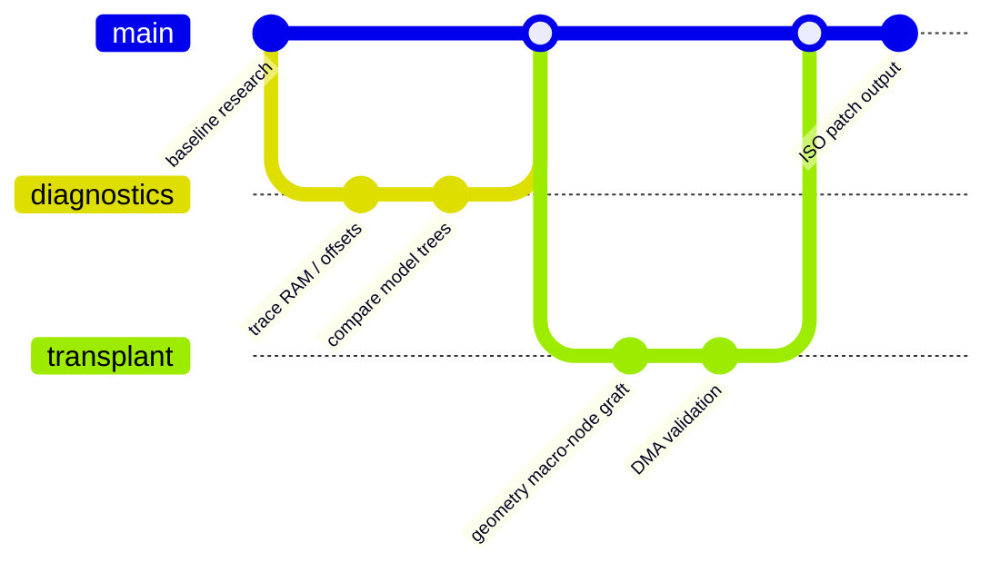

<div align="center">

# Asset Injector

### EQOA Character Restoration & Hybrid Graft Pipeline

A PS2 reverse-engineering pipeline by **Ahmad Hassan (B-Ted)** for restoring original *EverQuest Online Adventures* character geometry inside the *Frontiers* client while preserving the runtime structures that keep the game stable.


</div>

---

## Project Purpose

Asset Injector is built around one practical goal: transplant original EQOA Vanilla character geometry into *EverQuest Online Adventures: Frontiers* without breaking the PS2 engine assumptions around skeleton memory, DMA packet layout, material state, or CDVD file loading.

The project is intentionally technical, but the motivation is human: keeping an older online world understandable, inspectable, and repairable instead of letting its formats and tooling disappear into scattered notes and one-off scripts.

| Area | Role |
| --- | --- |
| Main author | Ahmad Hassan (B-Ted) |
| Target platform | PlayStation 2 / PCSX2 |
| Main language | Python 3.12 |
| Primary task | Geometry-only macro-node transplant |
| Utility base | EQOA community tools organized under `UTILITIES/` |
| Output | Bootable patched Frontiers ISO |

---

## Status

| Capability | State | Notes |
| --- | --- | --- |
| Invisible character fix | Solved | Preserves Frontiers render-critical material state. |
| `0x0` TLB miss crash | Solved | Avoids EE skeleton buffer overflow. |
| DMA/VIF integrity | Solved | Moves whole geometry macro-nodes instead of splicing float arrays. |
| In-place ISO patching | Implemented | Avoids rebuilding layouts that break PS2 CDVD expectations. |
| Documentation | Active | Architecture and workflow notes are being consolidated. |

---

## Architecture Overview

The pipeline is deliberately conservative. It keeps the Frontiers runtime container intact and replaces only the geometry macro-node that carries the Vanilla mesh payload.



### Core Design Rule

> Preserve the structures the Frontiers engine allocates and schedules. Replace the geometry payload only after it can be moved as a whole, aligned object.

That rule is why the project avoids naive binary merging. The PS2 engine is sensitive to node order, buffer size expectations, DMA alignment, VIF packet layout, material state, and UDF/CDVD placement.

---

## System Workflow



---

## Internal Module Structure

| Module | Responsibility |
| --- | --- |
| `core/clean_transplant_geom_only.py` | Main geometry-only macro-node transplant workflow. |
| `core/repack_iso.py` | In-place ISO payload replacement without destructive layout rebuilding. |
| `core/patch_udf_char_esf_v2.py` | UDF allocation descriptor patching for updated `CHAR.ESF` lengths. |
| `core/validate_dma.py` | Low-level DMA tag integrity checks. |
| `core/audit_materials.py` | Material node inspection and render-state validation. |
| `core/w_component_audit.py` | Verifies `W` component preservation, including ADC bit behavior. |
| `core/esf_parser.py` | Binary ESF structure parsing. |
| `core/esf_rebuilder.py` | Rebuild support for modified ESF payloads. |
| `diagnostics/` | Focused inspection scripts for offsets, trees, payloads, textures, and runtime behavior. |
| `UTILITIES/` | Community utility repos, tools, format references, and server implementations. |



---

## Data Flow



---

## Patch Lifecycle

| Phase | What Happens | Why It Exists |
| --- | --- | --- |
| 1. Baseline preparation | Required Vanilla and Frontiers assets are placed in expected folders. | Keeps original and target data separated. |
| 2. Database parsing | ESF/CSF records and pointer tables are inspected. | Prevents guesswork around offsets and payload sizes. |
| 3. Structural comparison | Vanilla and Frontiers model trees are compared. | Identifies what can move and what must stay native. |
| 4. Macro-node graft | Vanilla `0x02610` geometry is inserted into a Frontiers-safe wrapper. | Preserves DMA chain integrity. |
| 5. Verification | DMA tags, materials, skeleton assumptions, and payload boundaries are audited. | Catches runtime-breaking mistakes before ISO patching. |
| 6. ISO patching | `CHAR.ESF` is patched directly into the original ISO layout. | Avoids CDVD/LBA breakage from full ISO rebuilds. |
| 7. Runtime testing | Patched output is tested in emulator. | Confirms the fix survives actual engine behavior. |

---

## Technical Problem

Early transplant attempts failed for four engine-level reasons:

| Problem | Cause | Resolution |
| --- | --- | --- |
| EE skeleton overflow | Vanilla models used a smaller skeleton than the Frontiers animation controller expected. | Preserve Frontiers skeleton and bone matrix allocation. |
| DMA tag misalignment | Splicing float arrays disturbed strict 16-byte packet boundaries. | Move the entire geometry macro-node instead of partial data. |
| ADC bit damage | Zeroing `W` destroyed the anti-double-clipping bit. | Preserve the original packed vertex payload. |
| Render rejection | Vanilla material nodes did not match Frontiers render expectations. | Preserve Frontiers material state. |

---

## Build & Deployment Pipeline



### Quick Start

1. Clone or download this repository.
2. Run `setup_environment.bat`.
3. Confirm the required baseline ISOs exist:
   - `iso/unpatched/EQOA_Original.iso`
   - `iso/unpatched/EQOA_Frontiers.iso`
4. Run `EQOA_MASTER_TOOL.bat`.
5. Choose `Patch Game ISO`.
6. Test the generated ISO from `iso/patched/`.

> Close the emulator before patching. Open file handles can cause `[Errno 13] Permission Denied` during ISO writes.

---

## Repository Structure

```text
Asset-Injector/
├── core/                     # transplant, parsing, patching, and validation logic
├── diagnostics/              # focused analysis and runtime investigation scripts
├── docs/                     # reports, architecture notes, testing notes, project context
├── iso/
│   ├── unpatched/            # local baseline ISO inputs
│   ├── patched/              # generated patched ISO outputs
│   └── legacy/               # retained legacy ISO workspace
├── assets/                   # tracked lightweight asset fixtures and placeholders
├── UTILITIES/                # external EQOA tools and reference projects as submodules
├── legacy/                   # older scripts kept for traceability
├── phase1_patch_ingame_models/
├── phase2_preserve_baseline/
├── phase3_patch_character_selection/
├── phase4_unified_patch/
├── workspace/                # working files, extracted data, scratch analysis, reports
├── EQOA_MASTER_TOOL.bat      # main operator entry point
├── setup_environment.bat     # environment/bootstrap helper
└── README.md
```

---

## Utility Contributions

Asset Injector is authored and maintained by **Ahmad Hassan (B-Ted)**. The project also stands on useful EQOA community tooling. The people below created tools, data references, server implementations, patches, and format research that support the work organized in this repository.

| Contributor | Contribution used in this project |
| --- | --- |
| [benturi](https://github.com/benturi) | `ben_eqoa_c_server`, C server and packet-handling reference. |
| [rosyfiles](https://github.com/rosyfiles) | `EQOA_Addons`, Lua addon and workflow helper scripts. |
| [devin103](https://github.com/devin103) | `EQOA_Creator`, `EQOA-Frontiers-ISO-Patch`, `EQOA-Prototype-Server`. |
| [Jadiction](https://github.com/Jadiction) | `EQOA-Data`, structured EQOA game data reference. |
| [DabDavis](https://github.com/DabDavis) | `eqoa-esf-tools` and `eqoa-pipeline`, ESF/CSF and runtime pipeline tooling. |
| [userrnx](https://github.com/userrnx) | `EQOA-Ranix`, EQOA utility/reference work. |
| [joukop](https://github.com/joukop) | `EQOA-server` and `ESF-file-format`, server and format references. |
| [eqoa](https://github.com/eqoa) | `eqoa.github.io`, public EQOA reference material. |
| [EQOAReturnHome](https://github.com/EQOAReturnHome) | `EQOAGameServer`, modern server implementation. |
| [Dexr1te](https://github.com/Dexr1te) | `eqoazyc-api`, API/service reference. |
| [Faxonation2](https://github.com/Faxonation2) | `Hagley`, EQOA reference utility. |
| [Randall-Adams](https://github.com/Randall-Adams) | `Kairen`, EQOA reference utility. |
| [unenergizer](https://github.com/unenergizer) | `OpenEQOA`, open server/reference implementation. |
| [trevormorg](https://github.com/trevormorg) | `tech-eqoakv`, technical EQOA reference work. |
| [skulkingfox](https://github.com/skulkingfox) | `eqoa`, EQOA reference project. |

<details>
<summary>Utility submodule map</summary>

```text
UTILITIES/
├── ben_eqoa_c_server
├── EQOA_Addons
├── EQOA_Creator
├── EQOA-Data
├── eqoa-esf-tools
├── EQOA-Frontiers-ISO-Patch
├── EQOA-Prototype-Server
├── EQOA-Ranix
├── EQOA-server
├── eqoa.github.io
├── EQOAGameServer
├── eqoazyc-api
├── Hagley
├── Kairen
├── OpenEQOA
├── tech-eqoakv
├── eqoa
├── eqoa-pipeline
└── ESF-file-format
```

</details>

---

## Development Workflow



Recommended contribution path:

1. Start with a small, reproducible asset or diagnostic case.
2. Add evidence under `diagnostics/` or `docs/` before changing transplant behavior.
3. Keep binary patching changes isolated and explain offset assumptions.
4. Run the relevant verifier before trusting emulator output.
5. Document new findings where the next person will look first.

New people are welcomed, especially around documentation, reproducible diagnostics, safer validation, and clearer format notes.

---

## Documentation Map

| Document | Purpose |
| --- | --- |
| `CHANGELOG.md` | Project changes and utility contribution notes. |
| `PATCH_GUIDE.md` | Patch usage details. |
| `WALKTHROUGH_DEV.md` | Development walkthrough. |
| `docs/architecture.md` | Architecture notes. |
| `docs/DIAGNOSTICS_GUIDE.md` | Diagnostic workflow guidance. |
| `docs/TESTING_GUIDE.md` | Testing notes and validation guidance. |
| `docs/SOLUTION_REPORT.md` | Technical solution narrative. |

---

## Notes

This repository does not distribute commercial game ISOs. Baseline ISO files are local inputs and are intentionally ignored by Git.

The project is technical preservation work. The code favors explicit binary evidence, repeatable diagnostics, and narrow changes over broad rewrites.